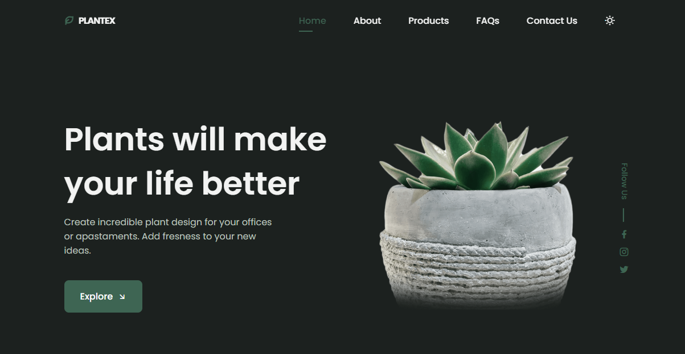

# Plantex 

## Responsive Plants Website

Welcome to **Plantex**, a responsive and modern website dedicated to bringing the beauty of plants into your life. Whether you're looking to enhance your office space, apartment, or simply add some greenery to your home, Plantex offers a wide variety of plants to suit your needs. Explore our products, learn more about plant care, and get in touch with us for any inquiries.

## Features

- **Responsive Design:** Optimized for all devices including desktops, tablets, and mobile phones.
- **Product Showcase:** Display a variety of plants with detailed descriptions and pricing.
- **FAQ Section:** Address common questions and provide helpful answers.
- **Contact Form:** Allow users to reach out for support or inquiries.
- **Newsletter Subscription:** Enable users to subscribe for updates and promotions.
- **Social Media Integration:** Connect with us through Facebook, Instagram, and Twitter.
- **Theme Toggle:** Switch between light and dark modes for a better user experience.

## Live Demo

Experience the website live on [Vercel](https://responsive-plants-website-pi.vercel.app/).

## Technologies Used

- **HTML5** - Structure of the website.
- **CSS3** - Styling and responsive design.
- **JavaScript (ES6)** - Interactive functionalities.
- **Remix Icon** - Icon library for UI elements.
- **ScrollReveal** - JavaScript library for scroll animations.
- **Vercel** - Deployment platform.

# Next Version Coming Soon!

